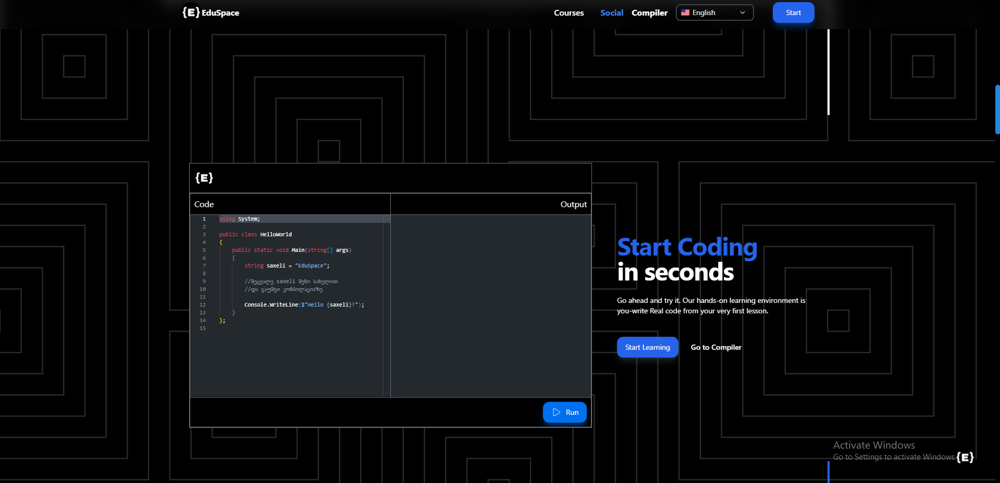
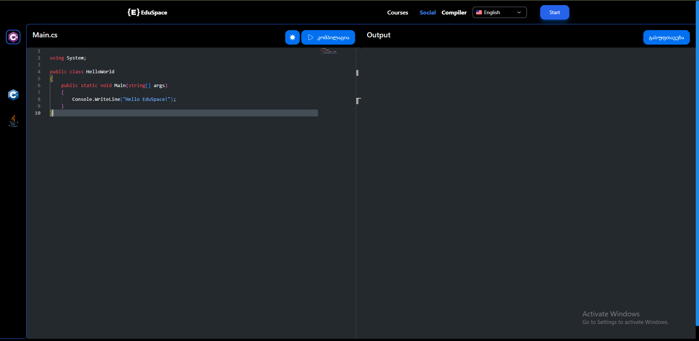
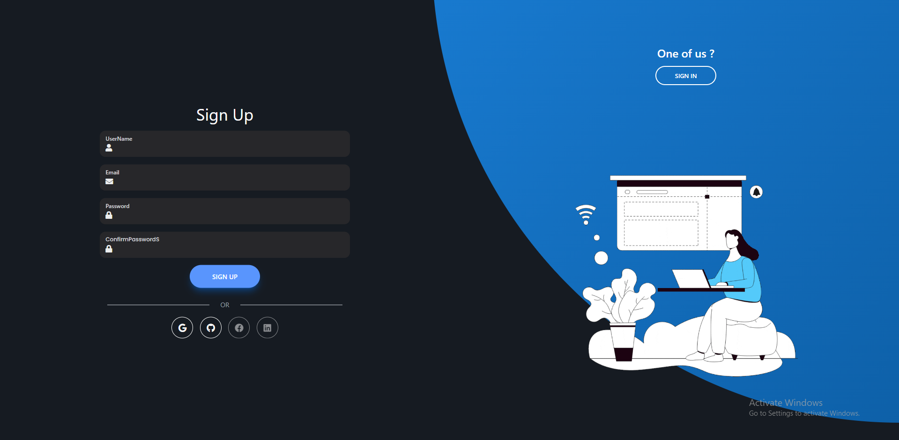

# Online Programming Learning Platform

Welcome to our online programming learning platform! This platform is designed to provide an interactive and engaging environment for learning programming languages. With features like user progress tracking, authentication, and an online compiler, users can enhance their coding skills conveniently.

## Table of Contents

- [Introduction](#introduction)
- [Features](#features)
- [Installation](#installation)
- [Usage](#usage)
- [Authentication and Authorization](#authentication-and-authorization)
- [Online Compiler](#online-compiler)
- [Screenshots](#screenshots)
- [Contributing](#contributing)

## Introduction

Our online programming learning platform offers a comprehensive set of tools and resources to help users learn and practice programming languages effectively. Whether you're a beginner or an experienced coder, you'll find everything you need to advance your skills and tackle coding challenges.

## Features

- User authentication and authorization system.
- Personalized user progress tracking.
- Interactive coding exercises and challenges.
- Integrated online compiler for real-time code execution.
- Community forums for collaboration and discussion.

## Installation

To get started with our online programming learning platform, follow these simple steps:

1. Clone this repository to your local machine.
2. Install dependencies using your preferred package manager (`npm install` or `yarn install`).
3. Set up the backend server and database.
4. Start the development server (`npm start` or `yarn start`).

## Usage

Explore the platform's features to enhance your programming skills:

1. Create an account or log in if you already have one.
2. Track your progress as you complete coding exercises and challenges.
3. Access the online compiler to write and execute code in various programming languages.
4. Engage with the community through forums and discussions.

## Authentication and Authorization

Our platform features a robust authentication and authorization system to ensure secure access to user accounts and data. Role-based permissions control user access to different features and functionalities, providing a seamless and personalized experience.

## Online Compiler

The integrated online compiler allows users to write, compile, and execute code directly within the platform. With support for multiple programming languages, users can test their code in real-time and receive immediate feedback.

## Screenshots

### Compiler Main Page

### Compiler 

### Registration

## Contributing

We welcome contributions from the community to enhance our online programming learning platform. To contribute:

1. Fork this repository and create a new branch for your contribution.
2. Make your changes, ensuring adherence to coding standards and guidelines.
3. Test your changes thoroughly.
4. Submit a pull request, providing a clear description of your changes and their purpose.
